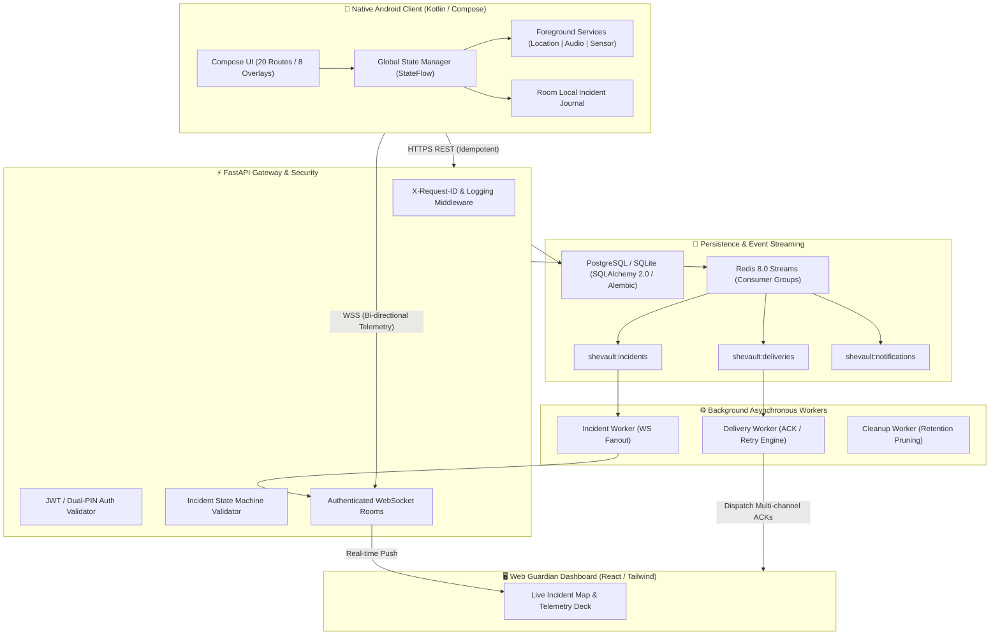
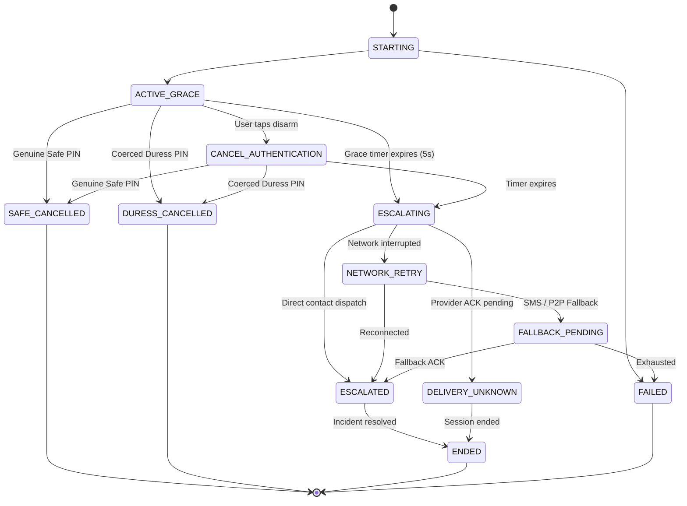

<div align="center">

# SheVault 🛡️

### *The Native Android-First Personal Safety Platform & Guardian Dispatch Engine*

[](android/)
[](android/)
[](android/)
[](backend/)
[](backend/)
[](backend/)
[](LICENSE)

<br/>

**SheVault** is an enterprise-grade, mission-critical personal safety architecture designed from the ground up for high-adversity environments. It pairs a native Android client featuring persistent foreground safety services, stealth decoy modes, and resilient telemetry with an asynchronous FastAPI and Redis Streams event engine and a real-time React guardian dashboard.

[System Architecture](#-system-architecture) •
[Core Security Invariants](#-core-security-invariants) •
[Mobile App](#-mobile-architecture) •
[Backend & Streams](#-backend-architecture) •
[Guardian Dashboard](#-react-guardian-dashboard) •
[Quickstart](#-quickstart-guide) •
[API Specification](docs/api-contract.md)

</div>

---

## 🌟 Key Highlights & Safety Innovations

1. **Covert Duress Disarm (Anti-Enumeration)**:
   - When an aggressor forces cancellation, entering the **Duress PIN (`9999`)** generates a disarm screen that is **visually and structurally identical** to genuine cancellation (`"✓ You're Safe"`, `"Safety session ended"`).
   - Under the hood, the incident transitions to `DURESS_CANCELLED` and immediately dispatches silent high-priority covert escalations to trusted contacts via Redis Streams. The client UI never displays *"Duress Detected"*.
2. **Deterministic SOS Activation Component**:
   - Long-press activation (1.2–1.5s) with **300ms recontact tolerance** to survive accidental brief finger slips.
   - Secondary panic gesture detection with a grace period before irreversible escalation.
3. **Decoy Discreet Mode**:
   - A fully functional, zero-branded dark calculator decoy with real arithmetic.
   - Unlocked exclusively via a stealth sequence (`==` or secret code). Contains zero red emergency banners or safety terminology.
4. **Defensible Safe Route Guidance**:
   - Avoids unsubstantiated percentage claims (e.g. *"93% safe"*). Evaluates transparent, verifiable factors: verified lighting, high-frequency transit hubs, active commercial corridors, and emergency services proximity.
5. **Zero Raw Emergency Hex Rule**:
   - Strict design token governance. Raw emergency hex literals (`0xFFC92A32` / `#C92A32`) are quarantined strictly in `ColorTokens.kt` and `tokens.ts`; application code strictly consumes `SheVaultColors.emergency`.
6. **Multi-Channel Delivery ACK Pipeline**:
   - Explicitly separates `"server accepted"` from `"guardian notified"`. Tracks states: `QUEUED` ➔ `SENDING` ➔ `ACKNOWLEDGED` ➔ `FAILED`.
7. **Ephemeral Location Retention**:
   - Automated retention workers purge high-frequency GPS coordinates after 7 days, maintaining cryptographic audit hashes for accountability without long-term location surveillance.

---

## 🏗️ System Architecture



---

## 🔒 Core Security Invariants

### 1. Incident Sealed State Machine

State transitions follow a single, immutable validation matrix implemented in `IncidentService`. Any jump outside permitted transitions is rejected with `409 Conflict` (`INVALID_STATE_TRANSITION`):



### 2. Dual-Credential Duress Protocol
```
User enters PIN:
  ├── Entered Safe PIN ('1234')
  │     ├── DB: Status -> SAFE_CANCELLED
  │     ├── Event: SAFE_CANCELLED
  │     └── Device UI: "✓ You're Safe. Safety session ended."
  │
  └── Entered Duress PIN ('9999')
        ├── DB: Status -> DURESS_CANCELLED (Internal)
        ├── Event: DURESS_CANCELLED
        ├── Stream: shevault:deliveries (Priority: CRITICAL, Duress: TRUE)
        ├── Contacts: Urgent silent alerts dispatched immediately
        └── Device UI: "✓ You're Safe. Safety session ended." (IDENTICAL OUTPUT)
```

---

## 📱 Mobile Architecture

Located in `android/`:
- **Jetpack Compose + Material 3**: Design system tokens for Plum (`#6D2E5B`), Rose (`#C85C7B`), Peach (`#F4B6A6`), Safe (`#0F766E`), Emergency (`#C92A32`).
- **20 Complete Screen Routes**:
  - `/onboarding` (7-step wizard: Profile, Circle, Permissions, Dual PINs, Ready)
  - `/home` (Header, SafetyStatusCard, Centered large SOS, Quick tools, Recent activity)
  - `/sos` (Active emergency session, 5-second grace countdown, circular progress ring, pulse ring, haptics)
  - `/incident` (Live incident command deck, vector map placeholder, telemetry metrics, audited timeline)
  - `/cancel` & `/duress` (2-step authentication dialog, keypad with dot indicators, anti-enumeration disarm flow)
  - `/trusted-circle` & `/add-contact` (Circle cards, granular permission toggles: alerts, location, battery)
  - `/safe-route` (Defensible navigation factoring lighting, transit hubs, and commercial density)
  - `/check-in` (Configurable countdown timer with overdue escalation alerts)
  - `/history` & `/history/{id}` (Grouped incident timeline with delivery ACK statuses)
  - `/discreet` (Operational calculator decoy with arithmetic and hidden `==` unlock)
  - `/settings` & `/settings/*` (Account, Privacy, Permissions, Security, Notifications, About)
  - `/simulator` (Developer control deck to hot-swap between app states)
- **Foreground Service Integration**: Declares Android 14+ requirements for `location`, `microphone`, and `dataSync`.
- **Offline & Low-Connectivity Resilience**: SQLite Room database logs local events when cellular connectivity is severed.

---

## ⚡ Backend Architecture

Located in `backend/`:
- **FastAPI (ASGI)**: High-concurrency async endpoints with OpenAPI documentation at `/docs`.
- **SQLAlchemy 2.0 + Alembic**: Type-safe mapped models with asynchronous migrations.
- **Redis 8.0 Streams**: Consumer groups with `XADD`, `XREADGROUP`, and `XACK` semantics ensuring zero dropped emergency dispatches.
- **WebSockets**: Authenticated bi-directional gateway with room isolation (`incident:{id}`).
- **Data Privacy & GDPR**: Configurable data retention policies and `/privacy/export` / `/privacy/account` endpoints.

---

## 🖥️ React Guardian Dashboard

Located in `dashboard/`:
- **Vite + React 18 + TypeScript + Tailwind CSS**: Real-time monitoring deck for trusted contacts and emergency dispatchers.
- **Live WebSocket Synchronization**: Live map updates, battery indicators, movement states, and delivery attempt verification logs.

---

## 📂 Repository Structure

```text
SheVault/
├── android/                         # Modular Android Studio project
│   ├── app/                         # App module, MainActivity (<35 lines), NavHost (20 routes)
│   ├── core/
│   │   ├── design/                  # ColorTokens, TypographyTokens, RadiusTokens, PinPad, Buttons
│   │   ├── database/                # Room entities: Incident, Event, Location, Contact
│   │   ├── network/                 # Retrofit / OkHttp clients & WebSocket listeners
│   │   ├── security/                # BiometricPrompt & Android Keystore integration
│   │   ├── permissions/             # Permission rationale engine
│   │   └── common/                  # AppState StateFlow, mock repositories, HapticManager
│   ├── feature/
│   │   ├── home/                    # HomeScreen & CheckInScreen
│   │   ├── sos/                     # SosScreen & SOS hold-to-activate component
│   │   ├── incident/                # IncidentScreen & CancellationFlowScreen
│   │   ├── trustedcircle/           # TrustedCircleScreen & AddContactScreen
│   │   ├── disretmode/              # Functional calculator decoy screen
│   │   ├── saferoute/               # Defensible safe routing interface
│   │   ├── history/                 # HistoryScreen & IncidentDetailScreen
│   │   ├── settings/                # Settings directory & Developer State Simulator
│   │   └── onboarding/              # 7-step onboarding wizard
│   └── service/                     # Modular foreground services
│       ├── IncidentService/         # Incident orchestration & escalation FGS
│       ├── LocationService/         # Fused location provider FGS
│       ├── SensorService/           # Accelerometer & motion detection FGS
│       └── DeliveryService/         # Network dispatch FGS
│
├── backend/                         # FastAPI + Redis Streams backend
│   ├── app/
│   │   ├── main.py                  # App entrypoint, lifespan, X-Request-ID, error handling
│   │   ├── core/                    # config.py, database.py, redis.py, security.py, logging.py, exceptions.py
│   │   ├── api/v1/                  # auth, users, devices, contacts, incidents, locations, checkins, privacy, health
│   │   ├── models/                  # User, Device, TrustedContact, Incident, IncidentEvent, LocationSample, DeliveryAttempt
│   │   ├── schemas/                 # Pydantic v2 schemas for all API payloads
│   │   ├── repositories/            # Async SQLAlchemy repository layer
│   │   ├── services/                # AuthService, IncidentService, EscalationService, DeliveryService, LocationService
│   │   ├── websocket/               # ConnectionManager & authenticated incident socket
│   │   └── workers/                 # IncidentWorker, DeliveryWorker, CleanupWorker
│   ├── alembic/                     # Database migrations
│   └── tests/                       # Pytest test suite (16 tests, 100% passing)
│
├── dashboard/                       # React 18 / TypeScript Guardian Dashboard
│   ├── src/
│   │   ├── App.tsx                  # Guardian incident monitoring deck
│   │   └── tokens.ts                # SheVault design tokens in TypeScript
│   └── package.json
│
├── docs/
│   └── api-contract.md              # Exhaustive API and WebSocket contract specification
├── CODE_OF_CONDUCT.md               # Contributor Covenant v2.1
├── LICENSE                          # MIT License
├── .gitignore                       # Multi-platform gitignore rules
└── docker-compose.yml               # Local Redis & PostgreSQL stack
```

---

## 🚀 Quickstart Guide

### Prerequisites
- **Android**: JDK 21, Android Studio Ladybug (or CLI tools), Android SDK 35.
- **Backend**: Python 3.11+, PostgreSQL 16 (or local async SQLite), Redis 7+.
- **Dashboard**: Node.js 18+, npm / pnpm.

---

### 1. Run the Backend API

```bash
cd backend

# 1. Create and activate virtual environment
python -m venv venv
source venv/bin/activate       # On Windows: .\venv\Scripts\Activate.ps1

# 2. Install dependencies
pip install -r requirements.txt

# 3. Apply database migrations
alembic upgrade head

# 4. Start backend with auto-reload
uvicorn app.main:app --host 0.0.0.0 --port 8000 --reload
```
API Documentation will be live at: **`http://localhost:8000/docs`**

---

### 2. Run Backend Unit & Integration Tests

```bash
cd backend
pytest -v
```
*(All 16 test suites covering auth, duress disarm, idempotency, state transitions, and WebSockets pass).*

---

### 3. Build & Run the Android App

```bash
cd android

# Compile all modules and generate Debug APK
./gradlew assembleDebug

# Run unit tests across all feature modules
./gradlew testDebugUnitTest
```
The compiled APK will be located at: `~/.gradle-build/shevault/app/outputs/apk/debug/app-debug.apk`.

---

### 4. Run the Guardian Web Dashboard

```bash
cd dashboard
npm install
npm run dev
```
Dashboard will be live at: **`http://localhost:5173`**.

---

## 🧪 Security & Verification Standards

| Security Requirement | Implementation Verification |
| :--- | :--- |
| **Covert Duress Anti-Enumeration** | Verified in `tests/test_incidents.py::test_covert_duress_cancellation`. Response is identical to safe cancel; duress flags are never leaked. |
| **Emergency Ingestion Idempotency** | Verified in `tests/test_incidents.py::test_idempotent_incident_creation`. Same `client_session_id` guarantees non-duplication. |
| **Impossible Transition Rejection** | Verified in `tests/test_state_machine.py`. Transitions like `ENDED -> ESCALATING` are blocked with HTTP 409. |
| **Zero Raw Emergency Hex Literals** | Verified in `tests/test_design_system_and_structure.py::test_critical_rule_no_hardcoded_emergency_color_in_application`. |
| **Thin MainActivity** | Verified in `tests/test_design_system_and_structure.py::test_main_activity_is_not_the_entire_application` (< 35 lines). |
| **Android 14+ FGS Manifests** | Verified in `tests/test_design_system_and_structure.py::test_foreground_service_types_declared_in_manifest`. |

---

## 🤝 Contributing

We welcome contributions from the safety, Android, and backend communities. Please review [CODE_OF_CONDUCT.md](CODE_OF_CONDUCT.md) before participating. For vulnerability disclosures, please review our security policy or email `safety@shevault.app`.

---

## 📄 License

SheVault is open-source software licensed under the **[MIT License](LICENSE)**.
Copyright © 2026 Rishi Sharma.
